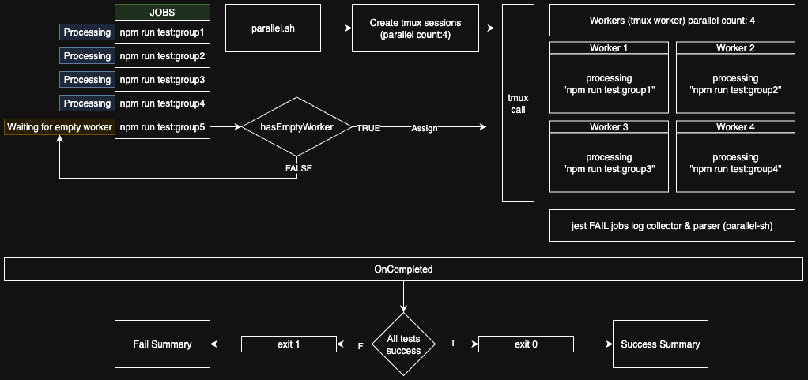

# 🚀 Parallel-Sh

**Smart test runner that executes bash commands in parallel and provides unified output**

Parallel-Sh runs your Jest tests in parallel based on your system resources and provides a comprehensive summary. Manage your grouped tests with a single command.

> **💡 Compatible with Husky Pre-Push Hooks:**  
Parallel-Sh can be easily integrated with tools like Husky to automatically run tests before pushing your code. This ensures your tests run in parallel and quickly before any code is pushed.


## ✨ Features

- 🔄 **Parallel Test Execution**: Configurable parallelism based on your system resources
- 🎯 **Test Grouping**: Logical organization of tests in groups
- ⚡ **Fast Results**: Quick test results through parallel execution
- 🛡️ **Auto Cleanup**: Automatic cleanup of temporary files
- 📋 **Detailed Error Reports**: In-depth analysis of failed tests

## 📂 Diagram & Demo




### Video Example


https://github.com/user-attachments/assets/26fee2bf-5696-4dcc-a484-2a2099050718


## 🚀 Quick Start

### 1. Installation

```bash
# Clone the repository
git clone <repository-url>
cd parallel-sh
# Move parallel-sh.sh to your project's home directory
# Make executable
chmod +x parallel-sh.sh
```

### 2. Define Your Test Groups

Define your test groups in your `package.json`:

```json
{
  "scripts": {
    "test:group1": "jest --testPathPattern='src/domains/(user|auth)'",
    "test:group2": "jest --testPathPattern='src/domains/(product|order)'",
    "test:group3": "jest --testPathPattern='src/domains/(payment|shipping)'",
    "test:group4": "jest --testPathPattern='src/domains/(notification|email)'",
    "test:group5": "jest --testPathPattern='src/domains/(analytics|reporting)'"
  }
}
```

### 3. Parallel-Sh Configuration

Define your commands in the `parallel-sh.sh` file:

```bash
commands=(
  "npm run test:group1"
  "npm run test:group2"
  "npm run test:group3"
  "npm run test:group4"
  "npm run test:group5"
)

command_names=(
  "user-auth-tests"
  "product-order-tests"
  "payment-shipping-tests"
  "notification-email-tests"
  "analytics-reporting-tests"
)
```

### 4. Run

```bash
# Run with default parallelism (4)
./parallel-sh.sh

# Run with custom parallelism
./parallel-sh.sh -p 2

# Run in detached mode
./parallel-sh.sh -d
```

## 📖 Usage

### Command Line Options

```bash
./parallel-sh.sh [OPTIONS]

Options:
  -p, --parallel COUNT    Number of commands to run in parallel (default: 4)
  -h, --help            Show this help message
```

### Usage Examples

```bash
# Run with 2 parallel processes
./parallel-sh.sh -p 2

# Run with 8 parallel processes (for powerful systems)
./parallel-sh.sh -p 8

```


## 📊 Output Examples

### Successful Test Run

```
🚀 Starting all commands with 4 parallel processes...
🚀 Started: user-auth-tests
🚀 Started: product-order-tests
🚀 Started: payment-shipping-tests
🚀 Started: notification-email-tests

⏳ Waiting for all tests to complete...

📊 Final Test Results Summary:
==============================
⏱️  Total Duration: 2m 15s

✅ PASSED Tests:
✅ user-auth-tests PASSED
✅ product-order-tests PASSED
✅ payment-shipping-tests PASSED
✅ notification-email-tests PASSED

🎉 All tests passed! 🎉
```

### Failed Test Run

```
❌ FAILED Tests:
❌ user-auth-tests FAILED
❌ product-order-tests FAILED

📋 Failed Test Cases:
=====================
📁 src/domains/user/user.test.js
   ✕ should validate user email
     ⏱️  Duration: 45 ms

📋 Detailed Test Failures:
==========================
## user-auth-tests Failures:
================================
📁 Test File: user.test.js
   should validate user email
   should authenticate user

Error Details:
Error: Expected "invalid-email" to be a valid email
```

## 🔧 Requirements

- **Bash**: Unix/Linux/macOS bash shell
- **tmux**: Terminal multiplexer (auto-installation)
- **Node.js**: For Jest tests
- **npm/yarn**: Package manager

### Auto Installation

Parallel-Sh checks if tmux is installed and automatically installs it if needed:

- **macOS**: Installation via Homebrew
- **Ubuntu/Debian**: Installation via apt
- **CentOS/RHEL**: Installation via dnf
- **Arch Linux**: Installation via pacman

## 🎯 Test Strategies

### 1. Logical Grouping

Group your tests by business logic:

```bash
# User operations
"npm run test:user"

# Product operations  
"npm run test:product"

# Payment operations
"npm run test:payment"
```

### 2. Parallelism Optimization

Adjust parallelism based on your system resources:

- **4 CPU Cores**: `-p 2` or `-p 3`
- **8 CPU Cores**: `-p 4` or `-p 6`
- **16+ CPU Cores**: `-p 8` or `-p 12`

### 3. Test Duration Optimization

Keep fast tests in separate groups:

```bash
# Fast tests (unit tests)
"npm run test:unit"

# Slow tests (integration tests)
"npm run test:integration"
```

## 🛠️ Advanced Configuration

### Custom Test Environment

```bash
# Environment variables
export NODE_ENV=test
export DATABASE_URL=test-db
export API_KEY=test-key

# Run Parallel-Sh
./parallel-sh.sh
```

### CI/CD Integration

```yaml
# .github/workflows/test.yml
- name: Run Tests
  run: |
    chmod +x parallel-sh.sh
    ./parallel-sh.sh -p 4
```

## 🔍 Troubleshooting

### Common Issues

1. **tmux not found**
   ```
   ⚠️  'tmux' is not installed.
   📦 Installing tmux with Homebrew...
   ```

2. **Memory insufficiency**
   ```bash
   # Increase Node.js memory limit
   export NODE_OPTIONS='--max_old_space_size=4096'
   ./parallel-sh.sh
   ```

3. **Test timeout**
   ```bash
   # Set Jest timeout
   "test:group1": "jest --testPathPattern='src/domains/(user|auth)' --testTimeout=30000"
   ```

### Debug Mode

```bash
# Attach to tmux session
tmux attach-session -t parallel-tests
```

## 📈 Performance Tips

1. **Optimize Test Files**: Remove unnecessary tests
2. **Use Mocks**: Mock heavy operations
3. **Optimize Parallelism**: Adjust based on CPU core count
4. **Memory Management**: Increase Node.js memory limit

